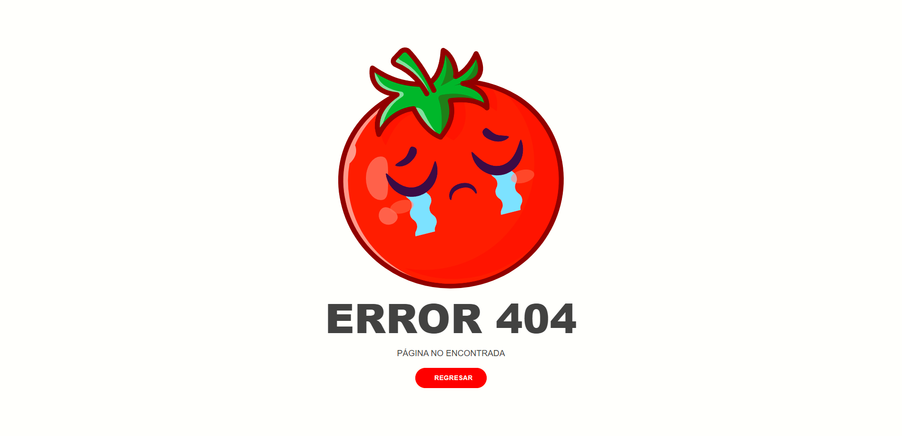

# TOMAPP

---

**Descripción de la Aplicación Web para Control de Ventas de Jitomates**

La aplicación proporciona una solución más eficiente, precisa y versátil en comparación con los procesos manuales. Ayuda a simplificar la gestión, reducir los errores y proporciona una visión más completa de las operaciones del negocio, lo que en última instancia mejora la rentabilidad y la toma de decisiones estratégicas.
Cuenta con los siguientes módulos:

1. **Registro de Viajes y Costos:**

   - La aplicación permitirá llevar un registro detallado de los viajes que el cliente realiza para comprar jitomates.
   - Se registrarán los costos asociados a cada viaje, lo que incluye gastos de transporte y otros costos relacionados.
   - Se capturará la cantidad de jitomates adquiridos en cada viaje.

2. **Cálculo de Costo Mínimo del Producto:**

   - La aplicación calculará el costo mínimo del producto, asegurando que el cliente no incurra en pérdidas. Esto se basará en los costos de los viajes y la cantidad de productos adquiridos.

3. **Gestión de Ventas:**

   - La aplicación permitirá gestionar las ventas de los productos de jitomate.
   - Cada venta se registrará, y automáticamente se descontará la cantidad de productos vendidos del inventario, asegurando un control preciso.

4. **Control de Almacén:**

   - Se llevará un control en tiempo real del inventario de jitomates en el almacén. Cualquier adición o venta se reflejará de inmediato en el stock disponible.

5. **Gestión de Deudores:**

   - La aplicación mantendrá un registro de quienes deben dinero al cliente, junto con la cantidad adeudada.
   - Facilitará el seguimiento de pagos y permitirá actualizar los registros cuando los deudores salden sus deudas.

6. **Registro de Envíos de Dinero:**

   - El cliente envía dinero a propietarios de huertas de las cuales provienen los jitomates.
   - La aplicación registrará todos los envíos realizados a lo largo del año.

7. **Generación de Reportes en PDF:**
   - La aplicación permitirá generar informes en formato PDF.
   - Estos informes incluirán datos sobre viajes, ventas, deudores, envíos de dinero y otros aspectos relevantes de la operación del cliente.

**Beneficios de la Aplicación:**

- **Mayor Eficiencia:** La aplicación automatiza numerosas tareas que actualmente se realizan manualmente en varias libretas, lo que ahorra tiempo y reduce errores.

- **Control Preciso:** El cliente tendrá un control más preciso sobre su negocio, desde los costos de viaje hasta el inventario y las finanzas.

- **Facilita el Seguimiento de Deudas:** El seguimiento de deudores será más efectivo, y se podrán identificar oportunidades para mejorar la recuperación de los fondos adeudados.

- **Historial Completo de Envíos de Dinero:** La aplicación proporciona un registro detallado de todos los envíos de dinero, lo que facilita la contabilidad y la toma de decisiones financieras.

- **Mayor Profesionalismo:** La generación de reportes en PDF le dará a tu cliente una documentación más profesional y organizada de su negocio.

---

# Capturas

